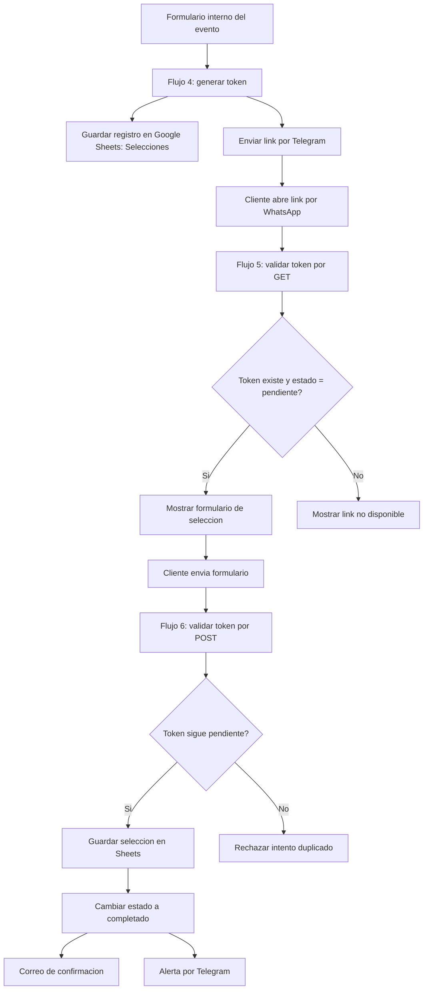
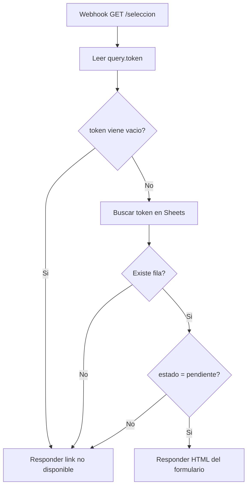
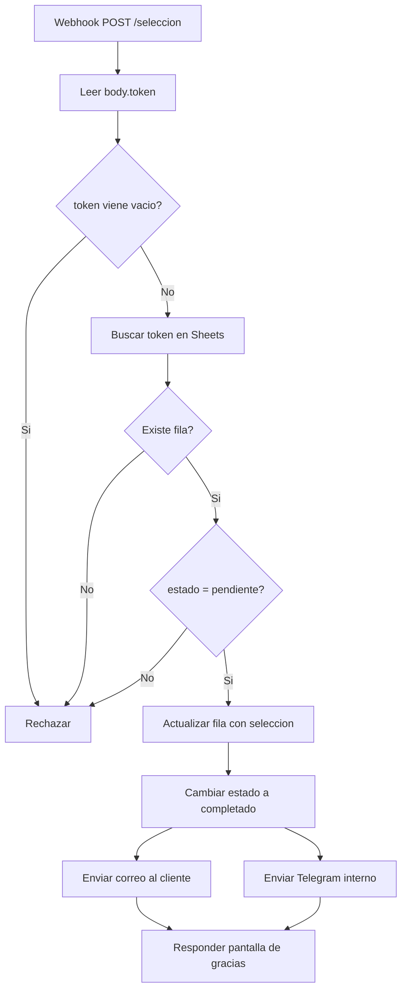

# Sistema de seleccion de menu por token

## Resumen del candado

El sistema debe aceptar una seleccion del cliente solamente cuando se cumplen dos condiciones al mismo tiempo:

1. El token existe en la hoja `Selecciones`.
2. El estado de ese token es `pendiente`.

Despues de enviar el formulario, el flujo debe cambiar el estado a `completado`. Ese cambio es lo que impide que el mismo enlace se use otra vez.

## Diagrama general



## Flujo 4: Generar link de seleccion

Entrada esperada:

- Nombre del cliente
- Email
- Telefono
- Fecha del evento
- Tipo de evento
- Paquete contratado

Salida esperada:

- Token unico con formato similar a `LC-1770000000000-ABC123`
- Link publico: `https://n8n.lacabanaeventos.com/webhook/seleccion?token=TOKEN`
- Registro en la hoja `Selecciones`
- Mensaje por Telegram con el link

Columnas minimas recomendadas en `Selecciones`:

| Columna | Uso |
| --- | --- |
| token | Llave unica que conecta los flujos 4, 5 y 6 |
| estado | Debe iniciar como `pendiente` y terminar como `completado` |
| nombre_cliente | Para mostrar o confirmar datos |
| email | Para enviar confirmacion |
| telefono | Para referencia del evento |
| fecha_evento | Para control operativo |
| tipo_evento | Para contexto del menu |
| paquete | Para condicionar opciones disponibles |
| menu_elegido | Se llena en flujo 6 |
| invitados | Se llena en flujo 6 |
| cocteleria | Se llena en flujo 6 |
| cerveza_barril | Se llena en flujo 6 |
| dietas_especiales | Se llena en flujo 6 |
| notas | Se llena en flujo 6 |
| fecha_seleccion | Se llena en flujo 6 |

## Flujo 5: Abrir formulario del cliente

Trigger recomendado:

- Nodo `Webhook`
- Metodo: `GET`
- Path: `seleccion`
- URL final: `https://n8n.lacabanaeventos.com/webhook/seleccion?token=TOKEN`

Logica recomendada:



Puntos criticos:

- El flujo debe leer el token desde `query.token`, no desde `body.token`.
- La busqueda en Google Sheets debe comparar contra la columna exacta `token`.
- El estado debe compararse de forma limpia: idealmente normalizar con minusculas y sin espacios.
- El formulario HTML debe incluir el token en un campo oculto para que el flujo 6 lo reciba.

Campo oculto necesario:

```html
<input type="hidden" name="token" value="{{TOKEN}}">
```

## Flujo 6: Guardar seleccion de menu

Trigger recomendado:

- Nodo `Webhook`
- Metodo: `POST`
- Path recomendado: `seleccion`
- El formulario del flujo 5 debe enviar a la URL de produccion del webhook.

Logica recomendada:



Puntos criticos:

- El flujo 6 debe volver a validar el token. No basta con que el flujo 5 haya mostrado el formulario.
- El update debe actualizar la misma fila encontrada, no crear una fila nueva duplicada.
- El cambio a `completado` debe ocurrir en la misma ruta exitosa donde se guardan los datos.
- Si falla el correo o Telegram, conviene decidir si aun asi la seleccion queda completada. Operativamente, lo mas seguro es guardar y completar primero, y mandar alertas despues.

## Problemas tipicos cuando no arranca

1. El flujo 4 guarda `Estado` pero el flujo 5 busca `estado`.
2. El token se guarda con espacios al final.
3. El flujo 5 usa `body.token` aunque el token viene en la URL como query.
4. El formulario no manda el token oculto al flujo 6.
5. El flujo 6 crea una fila nueva en vez de actualizar la fila del token.
6. El webhook de prueba de n8n funciona, pero el link usa la URL de produccion y el workflow no esta activo.
7. El path del webhook no coincide: por ejemplo `seleccion-menu` contra `seleccion`.
8. Hay dos nodos Webhook con el mismo path y metodo, o se esta probando el workflow equivocado.
9. La credencial de Google Sheets apunta a otro archivo o a otra pestaña.
10. La hoja `Selecciones` tiene encabezados duplicados o columnas movidas sin actualizar el nodo.

## Prueba ya realizada

Se probo esta URL con un token falso:

`https://n8n.lacabanaeventos.com/webhook/seleccion?token=LC-TEST-CODEX-0001`

Resultado observado:

- El sitio respondio con la pantalla `Este link ya no esta disponible`.
- Eso indica que el webhook publico de entrada existe y que el rechazo de tokens inexistentes funciona.

## Que falta revisar dentro de n8n y Google Sheets

En n8n:

- Nombre exacto de los workflows de flujo 4, flujo 5 y flujo 6.
- Si los workflows estan activos.
- Configuracion de los Webhook: metodo, path, URL test vs produccion.
- Nodos de Google Sheets: documento, pestaña, operacion, columna de busqueda.
- Nodos de IF/Switch: comparacion exacta de `estado`.
- HTML del formulario: action, method y campo oculto token.
- Nodos de correo y Telegram: que no bloqueen el guardado principal.

En Google Sheets:

- Existencia y encabezados de `Selecciones`.
- Si hay tokens duplicados.
- Si hay estados distintos como `Pendiente`, `pendiente `, `COMPLETADO`.
- Si el CRM y pestañas auxiliares alimentan algun flujo activo.
- Que pestañas pueden ocultarse, archivarse o eliminarse.

## Recomendacion para organizar el CRM

Pestanas recomendadas:

- `CRM`: vista principal de clientes y eventos.
- `Eventos`: datos operativos de cada evento contratado.
- `Selecciones`: control de tokens y seleccion de menu.
- `Menus`: catalogo de opciones disponibles.
- `Catalogos`: listas para validaciones, estados, paquetes, tipos de evento.
- `Bitacora`: registro de acciones automaticas o errores.

Formato recomendado para `CRM`:

- Congelar fila 1.
- Encabezados con fondo oscuro y texto claro.
- Filtros activos.
- Colores por estado del evento.
- Validaciones desplegables para estado, paquete y tipo de evento.
- Fechas con formato uniforme.
- Columnas clave al inicio: cliente, telefono, fecha evento, paquete, estado, pendiente por hacer.

