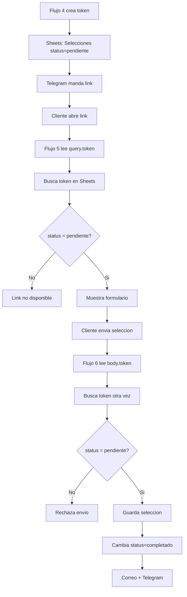

# Reporte de revision: tokens, flujo 5, flujo 6 y Google Sheet

## Resultado corto

El sistema si esta vivo, pero tiene una falla importante:

```text
El token TEST-ANGEL-001 abre el formulario aunque en la hoja aparece como completado.
```

Eso pasa porque en el codigo de los flujos 5 y 6 hay un atajo de prueba que fuerza ese token como si estuviera pendiente.

## Pruebas realizadas

### Prueba 1: token falso

URL probada:

```text
https://n8n.lacabanaeventos.com/webhook/seleccion?token=LC-TEST-CODEX-0001
```

Resultado:

```text
El sistema mostro: Este link ya no esta disponible
```

Conclusion:

```text
La puerta del Flujo 5 existe y si rechaza tokens que no conoce.
```

### Prueba 2: token TEST-ANGEL-001

URL probada:

```text
https://n8n.lacabanaeventos.com/webhook/seleccion?token=TEST-ANGEL-001
```

Resultado:

```text
El sistema abrio el formulario de seleccion.
```

Pero en la salida del nodo de Sheets ese token aparece con:

```text
status = completado
```

Conclusion:

```text
Aqui esta el bug: ese token ya no deberia abrir.
```

## Explicacion como cuento

Tu sistema debe funcionar asi:

```text
Cliente trae pulserita/token
        |
        v
n8n busca en la lista de Google Sheets
        |
        v
Si dice pendiente: pasa
Si dice completado: no pasa
```

Pero ahorita hay una excepcion escondida:

```text
Si el token es TEST-ANGEL-001:
    dejalo pasar aunque la hoja diga otra cosa
```

O sea:

```text
La puerta tiene guardia,
pero tambien hay una llave de prueba debajo del tapete.
```

Esa llave hay que quitarla.

## Flujo 5 revisado

Nombre:

```text
La Cabaña — Flujo 5: Servir Formulario de Selección
```

Estructura:

```text
Webhook — Abrir formulario
        |
Sheets — Leer selecciones
        |
Construir formulario HTML
        |
Responder con HTML
```

Lo bueno:

- El webhook usa metodo GET.
- El nodo de Sheets lee la pestaña `Selecciones`.
- El codigo lee el token desde la URL con `query.token`.
- Si el token no sirve, responde pantalla de link no disponible.

Lo malo:

El nodo `Construir formulario HTML` tiene este atajo:

```javascript
if (token === 'TEST-ANGEL-001') {
  clientData = {
    nombre: 'Angel Figueroa',
    tipo_evento: 'Boda',
    fecha_evento: '2026-07-15',
    paquete_asignado: 'Herradura — Menú Clásico (3 tiempos)',
    status: 'pendiente'
  };
} else {
  const rows = $('Sheets — Leer selecciones').all();
  for (const row of rows) {
    if (row.json.token === token) { clientData = row.json; break; }
  }
}
```

Ese bloque debe cambiarse por busqueda real siempre:

```javascript
const token = String(
  $('Webhook — Abrir formulario').first().json.query?.token || ''
).trim();

let clientData = null;
const rows = $('Sheets — Leer selecciones').all();

for (const row of rows) {
  const rowToken = String(row.json.token || '').trim();
  if (rowToken === token) {
    clientData = row.json;
    break;
  }
}

const status = String(clientData?.status || '').trim().toLowerCase();
const isValid = Boolean(clientData && status === 'pendiente');
```

## Flujo 6 revisado

Nombre:

```text
La Cabaña — Flujo 6: Guardar Selección de Menú
```

Estructura:

```text
Webhook — Recibir selección
        |
Sheets — Leer para validar
        |
Validar token y extraer datos
        |
IF — ¿Token válido?
        |
        +--> true  -> Sheets — Guardar selección
        |            -> Email — Confirmación al cliente
        |            -> Telegram — Alerta selección
        |            -> Responder — Éxito
        |
        +--> false -> Responder — Token inválido
```

Lo bueno:

- El flujo vuelve a validar el token antes de guardar.
- Tiene rama de exito y rama de rechazo.
- Guarda en la pestaña `Selecciones`.
- Usa `Append or Update Row`, que es la idea correcta para no crear duplicados.

Lo malo:

El nodo `Validar token y extraer datos` tambien tiene el atajo:

```javascript
if (token === 'TEST-ANGEL-001') {
  clientData = {
    nombre: 'Angel Figueroa',
    email: '...',
    telefono: '...',
    fecha_evento: '2026-07-15',
    tipo_evento: 'Boda',
    paquete_asignado: 'Herradura — Menú Clásico (3 tiempos)',
    status: 'pendiente'
  };
} else {
  const rows = $('Sheets — Leer para validar').all();
  for (const row of rows) {
    if (row.json.token === token) { clientData = row.json; break; }
  }
}
```

Debe cambiarse por:

```javascript
const body = $('Webhook — Recibir selección').first().json.body
  || $('Webhook — Recibir selección').first().json;

const token = String(body.token || '').trim();

let clientData = null;
const rows = $('Sheets — Leer para validar').all();

for (const row of rows) {
  const rowToken = String(row.json.token || '').trim();
  if (rowToken === token) {
    clientData = row.json;
    break;
  }
}

const status = String(clientData?.status || '').trim().toLowerCase();
const isValid = Boolean(clientData && status === 'pendiente');
```

## Recomendacion sobre los nodos de Sheets

Ahorita los nodos de Sheets leen la hoja y luego el codigo busca el token.

Eso funciona, pero la mejor opcion es:

```text
Sheets node:
Buscar directamente donde columna token = token recibido
```

Asi n8n no carga toda la hoja cada vez.

Recomendacion:

```text
Flujo 5:
Sheets — Leer selecciones
Filtro: token = {{$('Webhook — Abrir formulario').first().json.query.token}}

Flujo 6:
Sheets — Leer para validar
Filtro: token = {{$('Webhook — Recibir selección').first().json.body.token}}
```

Y despues el codigo solo revisa:

```text
Existe fila?
status = pendiente?
```

## Google Sheet revisado

Archivo:

```text
La Cabaña — Leads
```

Pestanas vistas:

```text
Leads
Click
Selecciones
FICHA DEL CLIENTE
contenido_rendimiento
CRM
WhatsApp Leads
```

La pestaña importante para este sistema es:

```text
Selecciones
```

Columnas detectadas desde n8n:

```text
row_number
valid
token
nombre
email
telefono
fecha_evento
tipo_evento
paquete_asignado
status
menu_elegido
num_invitados
cocteleria
cerveza_barril
dietas_especiales
notas_cliente
fecha_seleccion
html_response
email_html
```

Estas columnas si coinciden con lo que usan Flujo 5 y Flujo 6.

## No recomiendo borrar pestanas todavia

No borre pestanas porque hay varios workflows publicados que parecen depender de ellas:

```text
Leads -> Flujo 1 / CRM automatico
WhatsApp Leads -> Flujo 9
CRM -> Flujo 8 y formato visual CRM
Selecciones -> Flujo 4, 5 y 6
Click / contenido_rendimiento -> marketing o tracking
FICHA DEL CLIENTE -> ficha operativa
```

La mejor practica es:

```text
Primero ocultar pestañas dudosas.
Despues revisar 1 semana si algun flujo falla.
Al final borrar solo las que nadie use.
```

## CRM: formato recomendado

Para que el CRM sea mas facil de usar:

```text
1. Congelar fila 1.
2. Activar filtros.
3. Encabezado verde oscuro con texto blanco.
4. Columna Estado con lista desplegable.
5. Colores por estado:
   - Nuevo: azul claro
   - Contactado: amarillo
   - Cotizado: naranja
   - Apartado: verde
   - Perdido: gris
6. Columnas clave al inicio:
   Cliente | Telefono | Fecha evento | Tipo evento | Paquete | Estado | Proxima accion
```

## Diagrama final corregido



## Pendiente de aplicar

Cambios necesarios:

```text
1. Quitar TEST-ANGEL-001 del Flujo 5.
2. Quitar TEST-ANGEL-001 del Flujo 6.
3. Normalizar status con trim().toLowerCase().
4. Revisar que el nodo Sheets — Guardar selección use token como llave de actualizacion.
5. Publicar de nuevo los workflows si n8n queda en modo Publish.
```

## Nota de seguridad

El nodo de Telegram muestra el token del bot dentro de la configuracion visible del nodo. Lo mas seguro es mover eso a una credencial o variable de n8n y regenerar el token del bot si ya quedo expuesto en capturas o revisiones.

